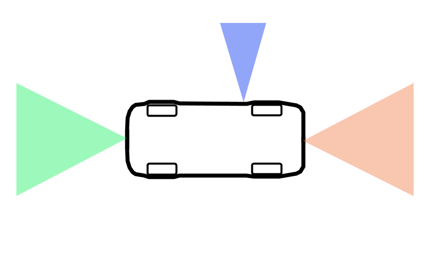

# Demonstrator requirements

## Autonomous vehicle challenges

O'PAVES aims at providing an open source/open hardware platform for the
prototyping and development of autonomous vehicles. For the first step of this
project, the goal is not to develop a fully autonomous car, but rather a
framework that will open the field to a broader audience by tackling the
electronic and real-time control software.

Inspired by the different autonomous vehicle competitions around the world, we
identified three main challenges that should be addressable by the platform:

 - Lane following
 - Obstacle avoidance
 - Autonomous parking

During the design of the platform, it will be important to keep those
challenges in mind to make sure that we provide the tools (sensors, interfaces,
computation power, etc.) that will allow users of O'PAVES to develop algorithms
addressing them. However, we do not plan to actually implement lane following
and obstacle avoidance as part of this one year project, the time frame being
too short.

## Active Safety Subsystems

To use the car to its maximum performance while keeping it in a safe state, the
O'PAVES platform will provide three active safety subsystems operating between
the driver and the car.

These systems will make sure to keep the car in a safe and controlled state,
potentially by overriding the driver's commands. The driver could be a human
operator or an artificial intelligence, both will benefit from this extra
safety and control.

### Anti-lock Braking System

During an emergency braking, the force applied to the brake discs might be so
strong that the wheels stop turning while the car is still in movement. The
wheels then skid on the road surface, reducing control of the vehicle while
increasing braking distance. The Anti-lock Braking System (ABS) will override
the driver's command and lower the braking force until the wheels regain
traction. This is now a common and unavoidable safety feature of modern cars,
it's even mandatory for all passenger car sold in the European union since
2004.

Requirements for the O'PAVES platform:

To implement ABS in our platform, we have to be able to control the braking
force applied to the wheels and measure the rotation speed to detect a
blockage.

### Traction Control System

While ABS avoids loss of traction during braking, Traction Control System (TCS)
does the same during acceleration. This allows for maximum performance while
keeping fine control of the vehicle's trajectory.

Requirements for the O'PAVES platform:

To implement TCS in our platform, we have to be able to control the
acceleration force applied to the wheels and measure the rotation speed of the
wheels.

### Emergency braking

Emergency braking is a safety system detects an imminent collision and
automatically brakes to avoid the collision. The detection is done by measuring
relative distance from the car a surrounding objects.

Requirements for the O'PAVES platform:

To implement the emergency braking system in our platform, we have to be able
to know the distance of obstacles to the front and rear of the car.

## Hardware requirements

### Frame

For the O'PAVES project we want to develop a platform that is as close as
possible to a consumer car to demonstrate the relevance of the tools and
technology that we are going to use. On the other hand we want to keep the cost
low and the platform easy to reproduce/make.

To satisfy those two very different constraints, we will use a scale model car
(1/10th, 1/12th or 1/18th) with rear-wheel drive and two front steering wheels.
Whether we will use an off-the-shelf remote controlled car or use 3D printed
parts is to be determined during the hardware development phase.

### Drivetrain and encoders

#### Direct drive, no differential

In order to make the base platform easy to create, we chose to keep the
drivetrain simple, and thus use a direct drive with no differential. This
direct drive with no differential is a simple component that is composed on an
axis (on which the rear wheels are fixed) and either a central motor or a
gearing mechanism allowing the motor to rotate the axis.

#### Motor

Two options are possible here: either brush or brushless DC motors.

##### Brush motors

DC brush motors are one of the simplest types of motors. A typical brush dc
motor consists of an armature (a.k.a., rotor), a commutator, brushes, an axle,
and a field magnet.

The brushes charge the commutator inversely in polarity to the permanent
magnet, in turn causing the armature to rotate. The rotation's direction,
clockwise and/or counterclockwise, can be reversed easily by reversing the
polarity of the brushes, i.e., reversing the leads on the battery.

##### Brushless motors

A typical brushless motor has permanent magnets which rotate around a fixed
armature, eliminating problems associated with connecting current to the moving
armature. An electronic controller replaces the brush/commutator assembly of
the brushed DC motor, which continually switches the phase to the windings to
keep the motor turning. The controller (ESC: Electronic Speed Controller)
performs similar timed power distribution by using a solid-state circuit rather
than the brush/commutator system.

In our context, using ESC and brushless motors look more appealing, in
particular because the controller knows the speed of the motor by using the
hall sensor. We could use this information for various features: position
calculation, anti-lock braking system, etc.

The ESC need to allow retrieving this information, very few models commonly
used in R/C propose a proper output.

An alternative would be to attach a coding wheel to the drivetrain.

### Sensors

#### Inertial Measurement Unit (IMU)

An IMU is a integrated sub-system that measures linear and angular motion
usually with multiple internal sensors (accelerometers, gyroscopes,
magnetometers). With the development of Micro-Electro-Mechanical-System (MEMS)
sensors, IMUs are getting smaller and cheaper.

#### Proximity/Range

To achieve the challenges of autonomous parking, obstacle avoidance and
emergency braking, the platform needs to know the distance of potential objects
around the car.

This task is best achieved with proximity sensors that deliver a distance
measurement. The platform will need, at least, one proximity sensor to the
front, one to the back and one to the right for autonomous parking.

There are different types of proximity sensors (infrared, ultra-sound, laser
time-of-flight). They all offer different performance, price, and integration
options.

The type, number, and location of sensors will be selected as part of the hardware
platform definition task (WP2).

### Processing

Regarding processing, we want to use an easily extendable microcontroller that
provides sufficient computation power and, ideally, that is well-known from the
public.

Most of the ARM Cortex-M based microcontrollers meet these high-level
requirements.

Moreover, AdaCore has already done a project that was based on this kind of
microcontrollers with the Crazyflie. The project consisted into reimplementing
the original firmware of the Crazyflie, a tiny customizable drone platform
based on a STM32F4 microcontroller, using Ada and SPARK. This project presents
many similarities with O'PAVES regarding high-level requirements (open source
platform, easily reproducible and customizable), hardware requirements
(sensors, frame, actuators...), and software requirements (main loop fetching
commands and sensor values to compute the required values for the actuators).

We made several measurements based on the reimplemented Crazyflie firmware to
have a better idea of our requirements in terms of CPU and memory usage.

Regarding CPU usage, we measured the time spent by the firmware's main loop
using a logic analyzer branched on a Crazyflie GPIO that is set to HIGH (3.3V)
) when entering the loop and cleared to LOW (0.0V) when leaving it. This main
loop task is called every 2 ms and our measurements indicated that it was
spending approximatively 1ms to execute (when compiled with debug flags).

For the memory usage, we combined two different static analysis approaches: the
ld linker --print-memory-usage switch that outputs the statically computed
memory usage for each defined memory region; an AdaCore tool called GNATstack
which can predict the maximum size of the memory stack required to host an
embedded software application.

By combining these two different approaches, we were able to measure the memory
usage of both ROM (~34%) and RAM (~54%).

CPU and memory usage measurements made on the reimplemented Crazyflie firmware
showed us that a similar microcontroller should perfectly fit the needs of the
OPAVES project.

### Communication

A communication link is needed to remotely control the car: general direction,
urgent stop, manual control.. The main requirements are price, bandwidth,
range, availability.

The well-known wireless links fit all the bill:

Protocol  | Freq            | Bandwidth | Range | Power | Modules
----------|-----------------|-----------|-------|-------|------------------
Bluetooth | 2.4Ghz          | 800 Kpbs  | <30m  | low   | ~10E, UART
BLE       | 2.4Ghz          | 270 Kpbs  | 50m   | low   | ~10E, UART or SPI
ZigBee    | 2.4 Ghz, 868Mhz | 250Kpbs   | 10m   | low   | ~20E, UART
Wifi      | 2.4, 3.6, 5 Ghz | 11 Mbps   | 30m   | high  | ~20E, UART

High bandwidth technology like Wifi could be interesting to transmit video, but
in that case would be less simple to use. All these technologies are available
as integrated modules using UART or SPI interface. The main advantage of these
modules is the ease of use (no need to know HF rules for PCB) and therefore the
possibility to test several of them.

We will start with Bluetooth as it is also available on laptops and cell
phones.

It might be interesting to also test a less common technology like Z-Wave, also
available as a UART module. It uses different frequencies (868 Mhz) and
therefore reduces interference risks.

## Test and validation

ISO26262 is an international standard for functional safety of electronic and
software systems in passenger cars. It defines requirements for software
development, specifically regarding design and implementation, unit testing,
integration testing or verification of software safety requirements.

One goal of the O'PAVES project is to use in an automotive context those
technologies that have proved successful in high-assurance application areas
such as aerospace and rail. To demonstrate relevance of those technologies we
are going to apply them to some of the requirements and mechanisms listed in
ISO26262. In particular:

 - Unit testing
 - Test coverage (MC/DC)
 - Formal notation for unit design
 - Formal verification
 - Static code analysis
 - Upper estimation of required resources
 - Compliance of the source code with the coding guidelines

We do not plan to apply all requirements to the entire software, but to
demonstrate tools and techniques on specific units. Deciding which tools and
techniques to use on which part of the software will be part of work packages 5
(Software development) and 6 (Test and validation).
